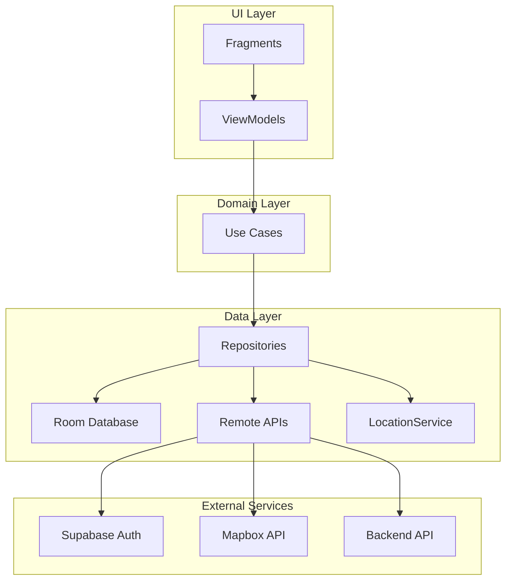
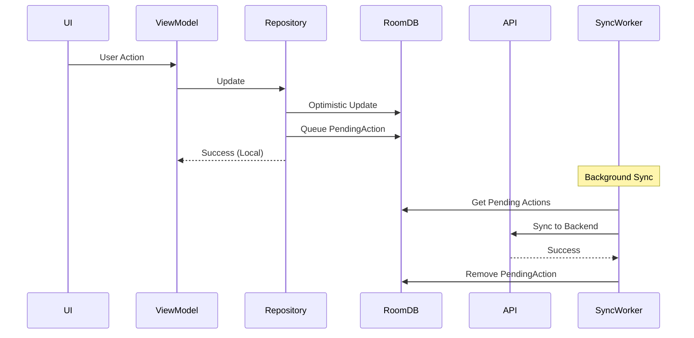
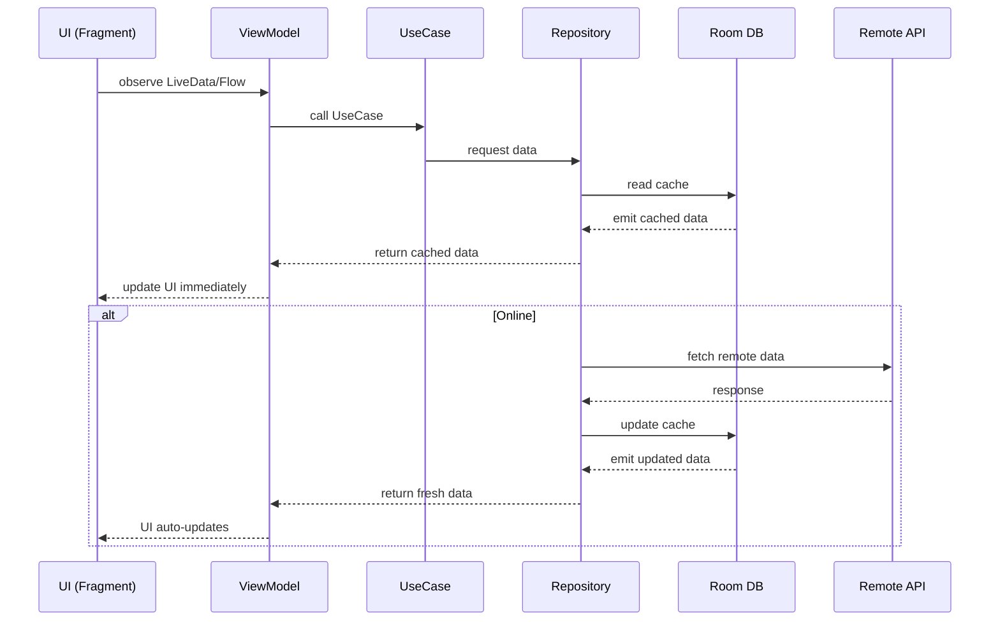
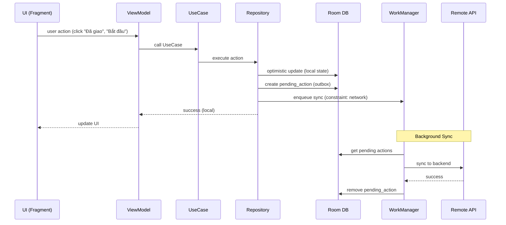
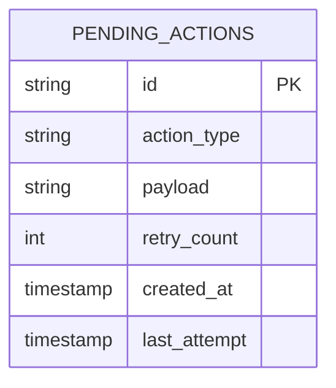

# WAYO Mobile Architecture

Tài liệu phân tích kiến trúc mã nguồn ứng dụng WAYO - Ứng dụng quản lý lộ trình giao hàng cho tài xế.

---

## Tổng quan

**Package:** `com.pikasonix.wayo`  
**Min SDK:** 24 | **Target SDK:** 36  
**Ngôn ngữ:** Kotlin  

Ứng dụng áp dụng kiến trúc **Clean Architecture** với mô hình **MVVM** (Model-View-ViewModel), hỗ trợ **Offline-First** cho việc quản lý routes và stops.

---

## Cấu trúc Thư mục

```
app/src/main/java/com/pikasonix/wayo/
├── MainActivity.kt            # Activity chính với Bottom Navigation
├── WayoApplication.kt         # Application class, khởi tạo Hilt & Mapbox
├── core/                      # Các thành phần core
│   ├── dispatcher/            # DispatcherProvider (IO, Main, Default)
│   ├── location/              # Core location types
│   ├── network/               # Network utilities
│   ├── result/                # AppResult & AppError sealed classes
│   └── security/              # SecureStorage (Encrypted SharedPreferences)
├── data/                      # Data Layer
│   ├── local/                 # Local database (Room)
│   │   ├── dao/               # Data Access Objects
│   │   ├── db/                # WayoDatabase
│   │   └── entity/            # Database entities
│   ├── location/              # LocationService (Fused Location)
│   ├── model/                 # Domain models
│   ├── remote/                # Remote services
│   │   └── backend/           # Backend API (Retrofit)
│   ├── repository/            # Repository layer
│   └── util/                  # Data utilities
├── di/                        # Dependency Injection (Hilt)
├── domain/                    # Domain Layer
│   └── usecase/               # Use Cases
├── ui/                        # Presentation Layer
│   ├── common/                # Common UI components
│   ├── viewmodel/             # ViewModels
│   └── xml/                   # XML-based UI fragments
├── utils/                     # Utilities
└── workers/                   # WorkManager workers
```

---

## Công nghệ & Dependencies

### Core
| Công nghệ | Mục đích |
|-----------|----------|
| **Hilt** | Dependency Injection |
| **Navigation Component** | Điều hướng giữa các Fragment |
| **ViewBinding + DataBinding** | Binding UI |
| **Coroutines + Flow** | Xử lý bất đồng bộ |

### Network
| Công nghệ | Mục đích |
|-----------|----------|
| **Retrofit + Moshi** | REST API calls tới backend |
| **OkHttp** | HTTP client với interceptors |
| **Supabase** | Authentication (Email/Password) |
| **Mapbox SDK** | Maps, Directions API, Geocoding |

### Local & Offline
| Công nghệ | Mục đích |
|-----------|----------|
| **Room** | Local SQLite database |
| **WorkManager** | Background sync (OutboxSyncWorker) |
| **DataStore** | Lightweight preferences |
| **EncryptedSharedPreferences** | Secure storage |

### UI
| Công nghệ | Mục đích |
|-----------|----------|
| **Material 3** | Design system |
| **Glide** | Image loading |
| **RecyclerView** | List displays |

---

## Sơ đồ Kiến trúc



---

## Data Layer

### Room Database

**Database:** `WayoDatabase`

| Entity | Mô tả |
|--------|-------|
| `DriverProfileEntity` | Hồ sơ tài xế |
| `VehicleEntity` | Thông tin phương tiện |
| `RouteEntity` | Thông tin route |
| `RouteStopEntity` | Các điểm dừng trên route |
| `OrderEntity` | Đơn hàng |
| `PendingActionEntity` | Actions chờ sync (offline queue) |

### DAOs
- `DriverProfileDao` - CRUD driver profile
- `VehiclesDao` - CRUD vehicles  
- `RoutesDao` - CRUD routes
- `RouteStopsDao` - CRUD route stops
- `OrdersDao` - CRUD orders
- `PendingActionsDao` - Outbox pattern cho offline sync

### Repositories

| Repository | Chức năng |
|------------|-----------|
| `AuthRepository` | Xác thực (Supabase Email/Password) |
| `BackendRouteRepository` | Quản lý routes với offline-first |
| `StopRepository` | Quản lý stops với optimistic updates |
| `OrderRepository` | Quản lý orders |
| `DriverProfileRepository` | Quản lý driver profile |
| `VehicleRepository` | Quản lý vehicles từ Supabase |
| `DriverVehicleRepository` | Kết hợp driver + vehicle |
| `RouteRepository` | Mapbox routing |
| `TrackingRepository` | Location tracking |
| `SyncRepository` | Background sync logic |
| `AssignedRouteRepository` | Routes được gán cho driver |

### Offline-First Pattern



---

## Domain Layer

### Use Cases

Organized by feature:

| Package | Use Cases |
|---------|-----------|
| `auth` | `LoginUseCase`, `LogoutUseCase`, `GetCurrentUserUseCase` |
| `profile` | `GetDriverProfileUseCase`, `UpdateDriverProfileUseCase` |
| `route` | `GetAssignedRoutesUseCase`, `StartRouteUseCase`, `CompleteRouteUseCase`, `GetRouteDetailsUseCase` |
| `stop` | `CompleteStopUseCase`, `GetStopDetailsUseCase` |
| `order` | `GetOrdersByRouteUseCase` |
| `sync` | `SyncPendingActionsUseCase`, `ForceRefreshUseCase`, `HasPendingChangesUseCase` |
| `tracking` | `StartTrackingUseCase` |

---

## UI Layer

### Navigation Graph

```
loginFragment ─────> routeSelectionFragment ────> assignedRoutesFragment
       │                                                  │
       v                                                  v       
signUpFragment                                    routeDetailsFragment
                                                          │
                                                          v
                                                     mapFragment
                                                          │
                                                          v
                                                    profileFragment
```

**Start Destination:** `loginFragment`

### Fragments

| Fragment | Chức năng |
|----------|-----------|
| `LoginFragment` | Đăng nhập |
| `SignUpFragment` | Đăng ký tài khoản |
| `DriverVehicleFragment` | Chọn xe trước khi bắt đầu |
| `AssignedRoutesFragment` | Danh sách routes được gán |
| `RouteDetailsFragment` | Chi tiết route với stops |
| `MapFragment` | Bản đồ navigation với Mapbox |
| `ProfileFragment` | Hồ sơ người dùng |

### ViewModels

| ViewModel | Lines | Chức năng |
|-----------|-------|-----------|
| `RoutingViewModel` | 755 | Core routing logic, map state, simulation |
| `LoginViewModel` | ~4k | Authentication flow |
| `SignUpViewModel` | ~5k | Registration flow |
| `AssignedRoutesViewModel` | ~2.5k | Routes list management |
| `RouteDetailsViewModel` | ~5.5k | Route details & stops |
| `MapViewModel` | ~5.5k | Map interactions |

---

## Data Models

### Route Models

```kotlin
// Core routing
data class LocationPoint(lat, lng, name?, address?)
data class RouteStep(instruction, distance, duration, maneuver?)
data class RouteLeg(distance, duration, steps, annotation?)
data class RouteInfo(origin, destination, waypoints, geometry, ...)

// Traffic annotation
data class RouteAnnotation(congestion[], speed[], duration[])

// Assigned routes
data class AssignedRoute(id, driverId, vehicleId, status, ...)
enum class RouteStatus { PLANNED, ASSIGNED, IN_PROGRESS, COMPLETED, CANCELLED }
```

### Vehicle Model

```kotlin
data class Vehicle(
    id, organizationId, licensePlate, 
    vehicleType,  // motorcycle, van, truck_small/medium/large
    capacityWeight, capacityVolume?,
    fuelConsumption?, costs?, ...
)
```

### User Model

```kotlin
data class User(id, email, fullName?, avatarUrl?, phone?, createdAt?)
```

---

## Dependency Injection

`AppModule.kt` cung cấp tất cả dependencies:

```kotlin
@Module
@InstallIn(SingletonComponent::class)
object AppModule {
    // Core
    @Provides fun provideDispatcherProvider()
    
    // Room
    @Provides fun provideWayoDatabase()
    @Provides fun provideXxxDao() // 6 DAOs
    
    // Network
    @Provides fun provideMoshi()
    @Provides fun provideOkHttpClient()  // With auth interceptor
    @Provides fun provideBackendApiService()
    
    // Services
    @Provides fun provideMapboxService()
    @Provides fun provideLocationService()
    
    // Repositories (explicit provides)
    @Provides fun provideRouteRepository()
    @Provides fun provideVehicleRepository()
    // ... others use @Inject constructor
}
```

---

## Cấu hình & Secrets

Các keys được quản lý qua `local.properties`:

```properties
SUPABASE_URL=https://xxx.supabase.co
SUPABASE_ANON_KEY=xxx
MAPBOX_ACCESS_TOKEN=pk.xxx
BACKEND_URL=http://10.0.2.2:3001/  # Emulator -> host
```

BuildConfig tự động generate các fields này.

---

## Workers

### OutboxSyncWorker

Background worker sync pending actions với backend:

- Enqueued periodically từ `WayoApplication`
- Sử dụng `HiltWorkerFactory` để inject dependencies
- Retry logic với exponential backoff

---

## Permissions

```xml
<uses-permission android:name="android.permission.INTERNET" />
<uses-permission android:name="android.permission.ACCESS_FINE_LOCATION" />
<uses-permission android:name="android.permission.ACCESS_COARSE_LOCATION" />
<uses-permission android:name="android.permission.ACCESS_BACKGROUND_LOCATION" />
<uses-permission android:name="android.permission.ACCESS_NETWORK_STATE" />
<uses-permission android:name="android.permission.FOREGROUND_SERVICE" />
<uses-permission android:name="android.permission.FOREGROUND_SERVICE_LOCATION" />
```

---

## Layouts

| Layout | Mô tả |
|--------|-------|
| `activity_main.xml` | Container với BottomNav + NavHost |
| `fragment_login.xml` | Login form |
| `fragment_signup.xml` | Registration form |
| `fragment_driver_vehicle.xml` | Vehicle selection |
| `fragment_assigned_routes.xml` | Routes list |
| `fragment_route_details.xml` | Route với stops list |
| `fragment_map.xml` | Mapbox map view |
| `fragment_profile.xml` | User profile |
| `item_*.xml` | RecyclerView item layouts |
| `bottom_sheet_stop_detail.xml` | Stop details bottom sheet |

---

## Testing

- **Unit Tests:** JUnit, Mockito, Coroutines Test
- **UI Tests:** Espresso
- **Code Coverage:** Jacoco configured
- **Navigation Testing:** `navigation-testing`
- **Work Testing:** `work-testing`
- **Room Testing:** `room-testing`

---

## Data Flow Chuẩn

### Luồng đọc dữ liệu (Offline-First)



**Quy trình:**

1. **UI (Fragment)** observe `LiveData`/`Flow` từ ViewModel
2. **ViewModel** gọi UseCase
3. **UseCase** gọi Repository
4. **Repository:**
   - Đọc cache từ Room → emit ngay
   - Nếu Online: gọi Remote API (Backend/Supabase), cập nhật Room
   - UI tự cập nhật khi Room thay đổi

### Luồng ghi dữ liệu (Queue + Sync)



**Quy trình:**

1. **UI** phát action (click "Đã giao", "Bắt đầu") → ViewModel
2. **ViewModel** gọi UseCase
3. **UseCase** gọi Repository
4. **Repository:**
   - Ghi trạng thái vào Room (local state)
   - Tạo bản ghi `pending_action` (outbox)
   - Enqueue WorkManager sync (constraint: network)

---

## UI Layer Chi Tiết

### ViewBinding vs DataBinding

| Approach | Ưu điểm | Use Case |
|----------|---------|----------|
| **ViewBinding** | Nhẹ, compile-time safety, không cần annotation processing | Hầu hết màn hình |
| **DataBinding** | Two-way binding, reduce boilerplate, expression language | Màn hình có binding mạnh (Profile, Login) |

**Khuyến nghị:**
- **ViewBinding** mặc định cho hầu hết màn hình
- **DataBinding** dùng cho màn hình có binding mạnh để giảm boilerplate

### State Model trong ViewModel

Sử dụng `LiveData<UiState>` hoặc `StateFlow<UiState>`:

```kotlin
data class UiState<T>(
    val loading: Boolean = false,
    val data: T? = null,
    val error: UiError? = null,
    val isOffline: Boolean = false
)

sealed class UiError {
    data class NetworkError(val message: String) : UiError()
    data class ServerError(val code: Int, val message: String) : UiError()
    object UnknownError : UiError()
}
```

**Best Practices:**
- Một `UiState` duy nhất cho mỗi màn hình
- Sử dụng `sealed class` cho lỗi để type-safe handling
- Track `isOffline` để hiển thị banner offline

---

## Domain Layer Chi Tiết

### Nguyên tắc UseCase

- **Mỗi hành động business** có một UseCase riêng
- UseCase **không biết Android UI** (pure Kotlin)
- UseCase **dễ unit-test** vì không có Android dependencies

### Tổ chức UseCases

| Nhóm | UseCases |
|------|----------|
| **Auth** | `LoginUseCase`, `SignUpUseCase`, `SignOutUseCase` |
| **Routes** | `GetAssignedRoutesUseCase`, `StartRouteUseCase`, `CompleteRouteUseCase` |
| **Stops/Orders** | `MarkStopCompletedUseCase`, `GetOrderDetailsUseCase` |
| **Sync** | `EnqueueSyncUseCase`, `SyncPendingActionsUseCase` |
| **Tracking** | `SendLocationPingUseCase` |

### UseCase Pattern

```kotlin
class GetAssignedRoutesUseCase @Inject constructor(
    private val routeRepository: AssignedRouteRepository
) {
    operator fun invoke(driverId: String): Flow<List<AssignedRoute>> {
        return routeRepository.getRoutesForDriver(driverId)
    }
}
```

---

## Data Layer Chi Tiết

### Remote Sources

| Source | Technology | Purpose |
|--------|------------|---------|
| **Backend (Node/Express)** | Retrofit + Moshi | Main API calls |
| **Supabase** | Supabase Kotlin SDK | Auth + Postgrest |
| **Map Provider** | Mapbox SDK | Directions/Geocoding |

**Testing Strategy:**
- Backend API: Mock Retrofit với OkHttp MockWebServer
- Supabase: Mock wrapper layer
- Mapbox: Fake implementation cho unit tests

### Local Sources

| Source | Purpose |
|--------|---------|
| **Room** | Cache entities (routes, stops, orders, vehicles, driver profile) |
| **Outbox Table** | Bảng `pending_actions` để đồng bộ offline actions |
| **EncryptedSharedPreferences** | Sensitive data (tokens) |
| **DataStore** | Non-sensitive preferences |

### Outbox Pattern



| Action Type | Payload |
|-------------|---------|
| `COMPLETE_STOP` | `{ stopId, completedAt, signature? }` |
| `START_ROUTE` | `{ routeId, startedAt, location }` |
| `COMPLETE_ROUTE` | `{ routeId, completedAt }` |
| `UPDATE_LOCATION` | `{ lat, lng, timestamp, speed? }` |

---

## Navigation Chi Tiết

### Navigation Component + Safe Args

- Sử dụng **Navigation Component** với Safe Args (Fragment-based)
- **Không dùng** Navigation Compose

### Navigation Graph Structure

```xml
<navigation 
    android:id="@+id/nav_graph"
    app:startDestination="@id/loginFragment">
    
    <fragment android:id="@+id/loginFragment">
        <action 
            android:id="@+id/action_login_to_vehicle"
            app:destination="@id/driverVehicleFragment" />
    </fragment>
    
    <fragment android:id="@+id/driverVehicleFragment">
        <action 
            android:id="@+id/action_vehicle_to_routes"
            app:destination="@id/assignedRoutesFragment" />
    </fragment>
    
    <!-- ... -->
</navigation>
```

### Deep Linking

Hỗ trợ deep link cho các màn hình quan trọng:

| Deep Link | Destination |
|-----------|-------------|
| `wayo://route/{routeId}` | Route Details |
| `wayo://stop/{stopId}` | Stop Details Bottom Sheet |

### Back Stack Management

- Sử dụng `popUpTo` và `popUpToInclusive` để quản lý back stack
- Login flow clear back stack khi đăng nhập thành công

```kotlin
// Navigate and clear back stack
findNavController().navigate(
    R.id.action_login_to_vehicle,
    null,
    NavOptions.Builder()
        .setPopUpTo(R.id.loginFragment, true)
        .build()
)
```

---

## Tóm tắt

WAYO Mobile là ứng dụng Android native cho tài xế giao hàng với các đặc điểm:

1. **Clean Architecture** - Phân tách rõ ràng UI/Domain/Data layers
2. **Offline-First** - Sử dụng Room + Outbox pattern cho sync
3. **Modern Stack** - Kotlin, Coroutines, Flow, Hilt
4. **Navigation** - Proper fragment navigation with safe args
5. **Maps** - Tích hợp Mapbox cho directions và geocoding
6. **Auth** - Supabase authentication
7. **Background Sync** - WorkManager cho reliability
