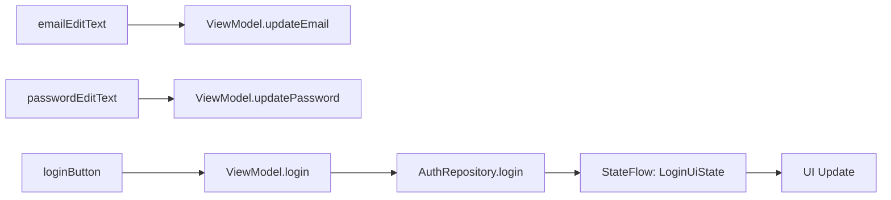
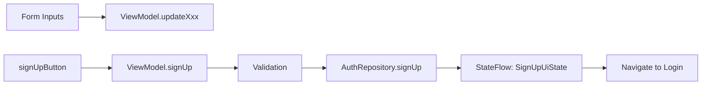
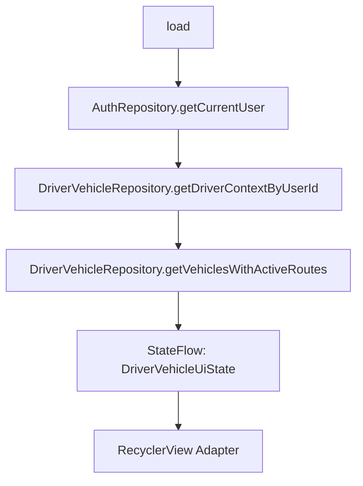
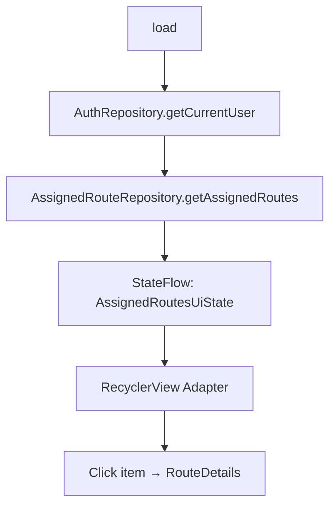
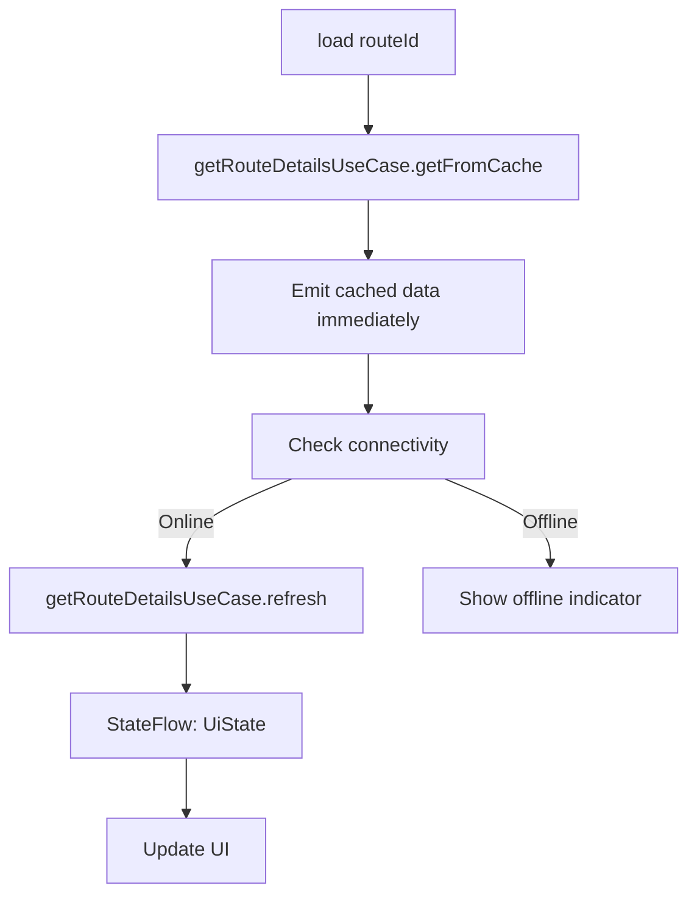
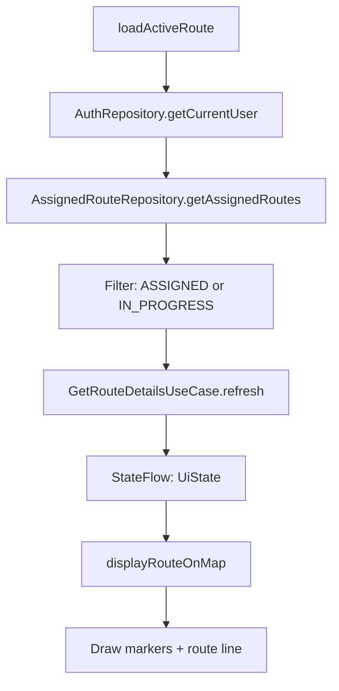
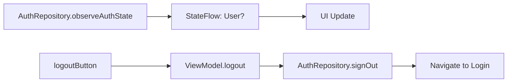

# WAYO Mobile UI Analysis

Phân tích chi tiết giao diện Fragment, data flow, và xử lý offline.

---

## Tổng Quan UI Pattern

| Pattern | Sử dụng |
|---------|---------|
| **Binding** | ViewBinding (tất cả Fragments) |
| **State Management** | `StateFlow<UiState>` |
| **Data Observation** | `repeatOnLifecycle` + `collect` |
| **LiveData** | ❌ Không sử dụng - Toàn bộ dùng `StateFlow` |
| **Offline Support** | `ConnectivityObserver` (RouteDetails, Map) |

---

## 1. LoginFragment

**Layout:** `fragment_login.xml`

### UI Components

| View | Type | Chức năng |
|------|------|-----------|
| `emailEditText` | `TextInputEditText` | Nhập email |
| `passwordEditText` | `TextInputEditText` | Nhập mật khẩu |
| `loginButton` | `Button` | Đăng nhập |
| `signUpLink` | `TextView` | Link đăng ký |
| `loading` | `ProgressBar` | Loading indicator |
| `errorText` | `TextView` | Hiển thị lỗi |

### Data Flow



### UiState Model

```kotlin
data class LoginUiState(
    val email: String = "",
    val password: String = "",
    val rememberMe: Boolean = false,
    val isLoading: Boolean = false,
    val error: String? = null,
    val isLoggedIn: Boolean = false,
    val user: User? = null,
    val verificationMessage: String? = null
)
```

### Offline Handling
❌ **Không hỗ trợ** - Yêu cầu kết nối mạng để đăng nhập

### LiveData/Flow
- `StateFlow<LoginUiState>` - observe qua `collect` trong `repeatOnLifecycle`

---

## 2. SignUpFragment

**Layout:** `fragment_signup.xml`

### UI Components

| View | Type | Chức năng |
|------|------|-----------|
| `emailEditText` | `TextInputEditText` | Nhập email |
| `phoneEditText` | `TextInputEditText` | Nhập số điện thoại |
| `passwordEditText` | `TextInputEditText` | Nhập mật khẩu |
| `confirmPasswordEditText` | `TextInputEditText` | Xác nhận mật khẩu |
| `termsCheckBox` | `CheckBox` | Đồng ý điều khoản |
| `signUpButton` | `Button` | Đăng ký |
| `loginLink` | `TextView` | Link đăng nhập |
| `loading` | `ProgressBar` | Loading indicator |
| `errorText` | `TextView` | Hiển thị lỗi |

### Data Flow



### UiState Model

```kotlin
data class SignUpUiState(
    val email: String = "",
    val phone: String = "",
    val password: String = "",
    val confirmPassword: String = "",
    val agreeTerms: Boolean = false,
    val isLoading: Boolean = false,
    val isSignUpSuccess: Boolean = false,
    val error: String? = null,
    val passwordError: String? = null
)
```

### Offline Handling
❌ **Không hỗ trợ** - Yêu cầu kết nối mạng để đăng ký

---

## 3. DriverVehicleFragment

**Layout:** `fragment_driver_vehicle.xml`

### UI Components

| View | Type | Chức năng |
|------|------|-----------|
| `vehiclesRecyclerView` | `RecyclerView` | Danh sách xe |
| `currentVehicleCard` | `CardView` | Hiển thị xe đang nhận |
| `currentVehicleText` | `TextView` | Text xe đang nhận |
| `unclaimButton` | `Button` | Bỏ nhận xe |
| `viewRoutesButton` | `Button` | Xem tuyến đường |
| `loading` | `ProgressBar` | Loading indicator |
| `emptyState` | `View` | Empty state |

### Data Flow



### UiState Model

```kotlin
data class DriverVehicleUiState(
    val isLoading: Boolean = false,
    val error: String? = null,
    val driverId: String? = null,
    val organizationId: String? = null,
    val vehicles: List<VehicleWithRoutes> = emptyList(),
    val currentVehicleId: String? = null
)
```

### Offline Handling
❌ **Không hỗ trợ offline** - Dữ liệu từ Supabase trực tiếp

---

## 4. AssignedRoutesFragment

**Layout:** `fragment_assigned_routes.xml`

### UI Components

| View | Type | Chức năng |
|------|------|-----------|
| `recyclerView` | `RecyclerView` | Danh sách routes |
| `goToVehiclesButton` | `Button` | Đi đến chọn xe |
| `loading` | `ProgressBar` | Loading indicator |
| `emptyState` | `View` | Empty state |

### Data Flow



### UiState Model

```kotlin
data class AssignedRoutesUiState(
    val isLoading: Boolean = false,
    val error: String? = null,
    val routes: List<AssignedRoute> = emptyList()
)
```

### Offline Handling
❌ **Không hỗ trợ offline** - Yêu cầu kết nối để fetch routes

---

## 5. RouteDetailsFragment ⭐

**Layout:** `fragment_route_details.xml`

### UI Components

| View | Type | Chức năng |
|------|------|-----------|
| `toolbar` | `MaterialToolbar` | App bar với back button |
| `tvRouteId` | `TextView` | Hiển thị route ID |
| `tvRouteStatus` | `TextView` | Trạng thái tuyến |
| `tvStopsProgress` | `TextView` | Tiến độ stops (2/5) |
| `tvOfflineIndicator` | `TextView` | Banner offline |
| `rvStops` | `RecyclerView` | Danh sách stops |
| `swipeRefresh` | `SwipeRefreshLayout` | Pull to refresh |
| `fabComplete` | `FloatingActionButton` | Hoàn thành tuyến |
| `progressBar` | `ProgressBar` | Loading indicator |

### Data Flow



### UiState Model

```kotlin
data class UiState(
    val isLoading: Boolean = false,
    val error: String? = null,
    val isOffline: Boolean = false,  // ⭐ Offline indicator
    val route: Route? = null,
    val stops: List<UiRouteStopItem> = emptyList()
)
```

### Offline Handling ✅

```kotlin
fun refresh(routeId: String) {
    viewModelScope.launch {
        val online = connectivityObserver.isCurrentlyConnected()
        _uiState.value = _uiState.value.copy(isOffline = !online)

        if (!online) {
            _uiState.value = _uiState.value.copy(isLoading = false)
            return@launch  // Sử dụng cache, không fetch
        }
        // ... fetch from API
    }
}
```

**Chiến lược Offline:**
1. Load cache từ Room trước (`getFromCache`)
2. Kiểm tra connectivity
3. Nếu offline: hiển thị `tvOfflineIndicator`, dùng cached data
4. Nếu online: refresh từ API

---

## 6. MapFragment ⭐

**Layout:** `fragment_map.xml`

### UI Components

| View | Type | Chức năng |
|------|------|-----------|
| `mapView` | `MapView` (Mapbox) | Bản đồ chính |
| `rvStopList` | `RecyclerView` | Danh sách stops ngang |
| `fabShowAll` | `FloatingActionButton` | Toggle all stops |
| `fabCenter` | `FloatingActionButton` | Center to location |
| `btnPrev` / `btnNext` | `ImageButton` | Navigate stops |
| `bottomSheet` | `BottomSheetDialog` | Chi tiết stop |

### Data Flow



### UiState Model

```kotlin
data class UiState(
    val isLoading: Boolean = false,
    val error: String? = null,
    val isOffline: Boolean = false,  // ⭐ Offline indicator
    val route: Route? = null,
    val stops: List<Stop> = emptyList()
)
```

### Offline Handling ✅

```kotlin
fun loadActiveRoute() {
    viewModelScope.launch {
        val online = connectivityObserver.isCurrentlyConnected()
        _uiState.value = _uiState.value.copy(isOffline = !online)
        // ...
    }
}
```

### Map Features
- **Markers**: Stop markers with custom icons
- **Route line**: GeoJSON line từ Mapbox Directions
- **Location tracking**: Fused Location Provider
- **Bottom sheet**: Chi tiết stop với nút "Hoàn thành"

---

## 7. ProfileFragment

**Layout:** `fragment_profile.xml`

### UI Components

| View | Type | Chức năng |
|------|------|-----------|
| `toolbar` | `MaterialToolbar` | App bar |
| `ivAvatar` | `ImageView` | Ảnh đại diện (Glide) |
| `tvFullName` | `TextView` | Tên tài xế |
| `tvEmail` | `TextView` | Email |
| `tvPhone` | `TextView` | Số điện thoại |
| `tvStatus` | `TextView` | Trạng thái hoạt động |
| `logoutButton` | `Button` | Đăng xuất |

### Data Flow



### State Model
- `StateFlow<User?>` - observe trực tiếp từ `AuthRepository`

### Offline Handling
❌ **Không yêu cầu** - Dữ liệu user được cache local

---

## So Sánh Fragments

| Fragment | Binding | StateFlow | Offline | RecyclerView | UseCase |
|----------|---------|-----------|---------|--------------|---------|
| Login | ✅ | ✅ LoginUiState | ❌ | ❌ | ❌ |
| SignUp | ✅ | ✅ SignUpUiState | ❌ | ❌ | ❌ |
| DriverVehicle | ✅ | ✅ DriverVehicleUiState | ❌ | ✅ | ❌ |
| AssignedRoutes | ✅ | ✅ AssignedRoutesUiState | ❌ | ✅ | ❌ |
| RouteDetails | ✅ | ✅ UiState | ✅ | ✅ | ✅ |
| Map | ✅ | ✅ UiState | ✅ | ✅ | ✅ |
| Profile | ✅ | ✅ User? | ❌ | ❌ | ❌ |

---

## Patterns Chung

### 1. ViewBinding Pattern

```kotlin
class XxxFragment : Fragment(R.layout.fragment_xxx) {
    private var binding: FragmentXxxBinding? = null
    
    override fun onViewCreated(view: View, savedInstanceState: Bundle?) {
        binding = FragmentXxxBinding.bind(view)
        // ...
    }
    
    override fun onDestroyView() {
        binding = null
        super.onDestroyView()
    }
}
```

### 2. StateFlow Collection Pattern

```kotlin
viewLifecycleOwner.lifecycleScope.launch {
    viewLifecycleOwner.repeatOnLifecycle(Lifecycle.State.STARTED) {
        viewModel.uiState.collect { state ->
            // Update UI based on state
            binding?.loading?.visibility = if (state.isLoading) View.VISIBLE else View.GONE
            binding?.errorText?.text = state.error
            // ...
        }
    }
}
```

### 3. ViewModel UiState Pattern

```kotlin
data class XxxUiState(
    val isLoading: Boolean = false,
    val error: String? = null,
    val isOffline: Boolean = false,  // Cho offline-aware screens
    val data: T? = null
)

@HiltViewModel
class XxxViewModel @Inject constructor(...) : ViewModel() {
    private val _uiState = MutableStateFlow(XxxUiState())
    val uiState: StateFlow<XxxUiState> = _uiState.asStateFlow()
}
```

### 4. Offline-First Pattern

```kotlin
// 1. Load cache first
val cached = useCase.getFromCache(id)
if (cached is AppResult.Success) {
    _uiState.value = _uiState.value.copy(data = cached.data)
}

// 2. Check connectivity
val online = connectivityObserver.isCurrentlyConnected()
_uiState.value = _uiState.value.copy(isOffline = !online)

// 3. Refresh if online
if (online) {
    val result = useCase.refresh(id)
    // Update state
}
```
